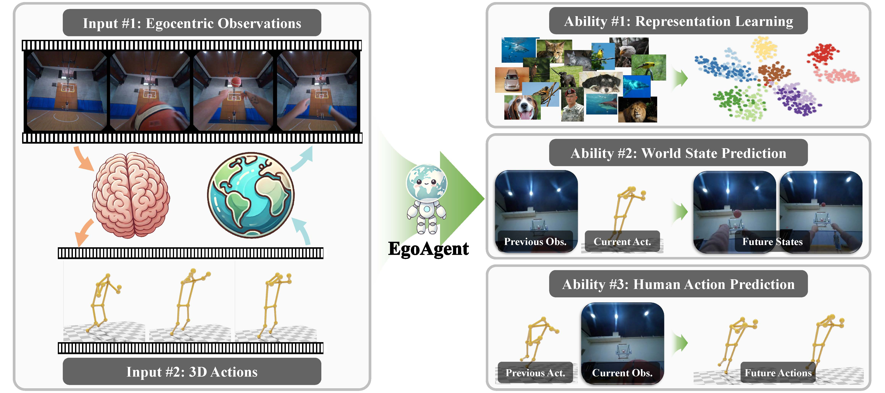

# EgoAgent: A Joint Predictive Agent Model in Egocentric Worlds

### [Project Page](https://egoagent.github.io) | [Paper](https://arxiv.org/abs/2502.05857)



## Setup

This project builds upon **[InternLM](https://github.com/InternLM/InternLM/tree/5539f9db5055307b6b7d7ce88b07d90d8136692b)**. Please follow its setup instructions for environment installation and dependencies.

Alternatively, you can set up the environment directly using:

```shell
conda env create -f environment.yaml
```

## Datasets Preparation

### Download

We use WalkingTours and Ego-Exo4D datasets.

For WalkingTours Dataset, please follow the instructions from [DoRA ICLR24](https://github.com/shashankvkt/DoRA_ICLR24/tree/main?tab=readme-ov-file#dataset-preparation) and visit [WalkingTours Dataset](https://uvaauas.figshare.com/articles/dataset/Dora_WalkingTours_Dataset_ICLR_2024_/25189275) to download videos and blur out faces within. Please put the downloaded mp4 videos at `data/WTour`.

For Ego-Exo4D dataset, please follow the instructions from [Ego-Exo4D Data](https://ego-exo4d-data.org/#download) and [Ego-Exo4D Document](https://docs.ego-exo4d-data.org/download/) to sign Ego-Exo4D licenses and download dataset (remember to do the aws configuration).

```shell
egoexo -o data/egoexo4d --parts annotations metadata
egoexo -o data/egoexo4d/egoexo4d_v1 --parts take_vrs --release v1
egoexo -o data/egoexo4d/egoexo4d_v2 --parts take_vrs --release v2
```

Note: (1) annotations contain 3D motion labels estimated from exocentric views, takes contain frame-aligned mp4 videos of egocentric and exocentric views, we only need egocentric videos, take_vrs is also needed since it contains the camera parameters for video undistortion and motion translation. (2) Ego-Exo4D V2 includes more video hours and exocentric labels than V1, please see [Ego-Exo4D Change Log](https://docs.ego-exo4d-data.org/changelog/) for more details.

### Preprocess

#### Extract WTour images

Install ffmpeg and run the following example command to extract video frames and save as images.

```shell
cd data/wtour
mkdir Walking_Tour_Wildlife
ffmpeg -i "Walking_Tour_Wildlife.mp4" "Walking_Tour_Wildlife/frame_%07d.jpg"
```

#### Undistort Ego-Exo4D captures

As Ego-Exo4D employs fisheye cameras, we undistort the images to a pinhole camera model using the official [Project Aria Tools](https://github.com/facebookresearch/projectaria_tools/tree/main) to align them with the WalkingTours videos. You may run the following script to perform the undistortion:

```shell
python dataset_preprocess/undistort_egovideos.py
```

#### Ego-Exo4D body pose translation

We translate the original body poses in Ego-Exo4D using the official [Ego-Exo4d Body Pose](https://github.com/EGO4D/ego-exo4d-egopose/blob/main/bodypose/data/dataset_egoexo.py) dataset. You may run the following script to process the body pose data:

```shell
python dataset_preprocess/undistort_egovideos.py
```

## Training

### Stage 1: Egocentric visual representation pretraining

Run the following script to pretrain the egocentric visual representation. The example below uses the **300M** model configuration, but a **1B** configuration is also available.

```shell
cd InternLM
{sbatch/srun command} scripts_train/source_slurm_train_stage1_contrastive_w_tokenizer.sh ${number_of_nodes} configs/dino_pretrain/lr5e-4_tmp004_300m.py ${number_of_workers}
```

### Stage 2: Representation-Prediction-Action joint training

After pretraining, use the following command to perform joint training. The example below uses the **300M** model configuration:

```shell
cd InternLM
{sbatch/srun command} scripts_train/slurm_train_stage2_contrastive_joint.sh configs/joint_train/lr6e-04_tmp004_300m.py ${number_of_gpus} ${seed}
```

You need to write the sbatch/srun command and modify the related parameters in the configuration file (configs/.../*.py) based on your cloud server and training plan.

## Evaluation

EgoAgent is evaluated on three tasks:

### ImageNet classification (kNN)

To evaluate EgoAgent's visual representation ability on ImageNet  using kNN classification, run:

```shell
cd InternLM/tools
python convert2hf_dino_conv_stem_cls.py --src_folder ../save_ckpt/{} --remove_vq_embed

cd ..
torchrun --nproc_per_node=4 --nnodes=1 --node_rank=0 eval_knn_conv_stem_cls.py --pretrained_weights ../hf_models/{}/ --imgnet 1000
```

### Future world state prediction

To evaluate future world state prediction, use:

```shell
cd InternLM
{sbatch/srun command} python -u eval_feature_retrieval.py --config ${CONFIG} --launcher ${LAUNCHER} --port ${PORT} --eval_iters ${eval_iters}
```

### 3D human motion prediction

To evaluate 3D human motion prediction, run:

```shell
cd InternLM
{sbatch/srun command} python -u python eval_3dposes.py --config ${CONFIG} --launcher ${LAUNCHER} --port ${PORT} --eval_iters ${eval_iters}
```

## Citation

If you find this project useful for your research, please cite it using the following BibTeX entry:

```
@misc{chen2025acquisition,
      title={Acquisition through My Eyes and Steps: A Joint Predictive Agent Model in Egocentric Worlds}, 
      author={Lu Chen and Yizhou Wang and Shixiang Tang and Qianhong Ma and Tong He and Wanli Ouyang and Xiaowei Zhou and Hujun Bao and Sida Peng},
      year={2025},
      eprint={2502.05857},
      url={https://arxiv.org/abs/2502.05857}, 
}
```

 ## Acknowledgement

We sincerely thank the authors of [InternLM](https://github.com/InternLM/InternLM/), [DINO](https://github.com/facebookresearch/dino/tree/main), and [Project Aria Tools](https://github.com/facebookresearch/projectaria_tools/tree/main) for their great works, without which our project/code would not be possible.

